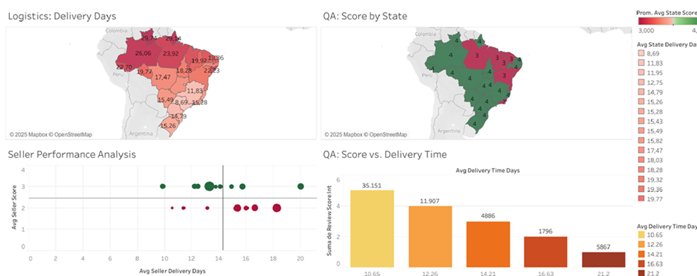
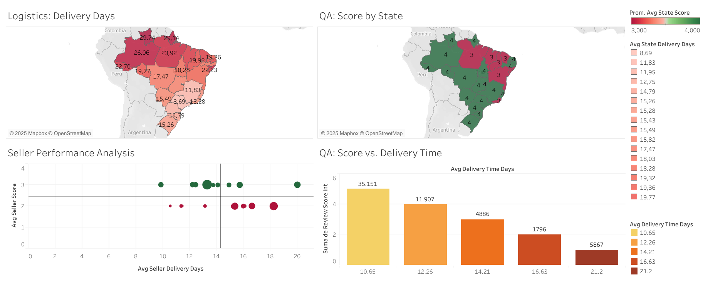
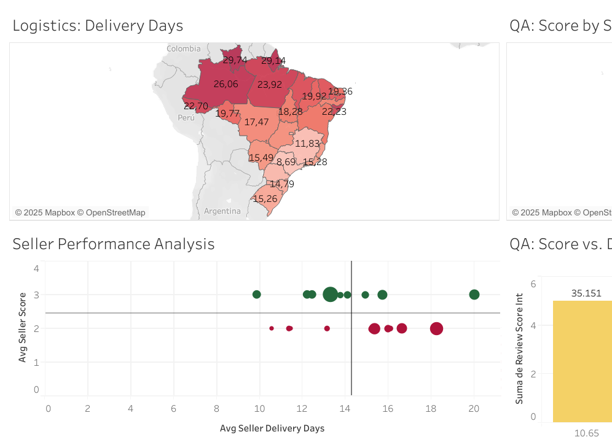
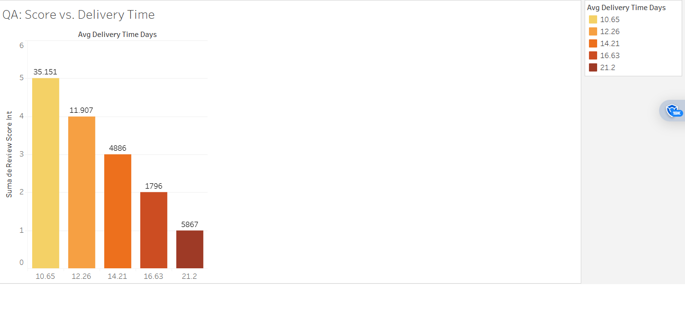
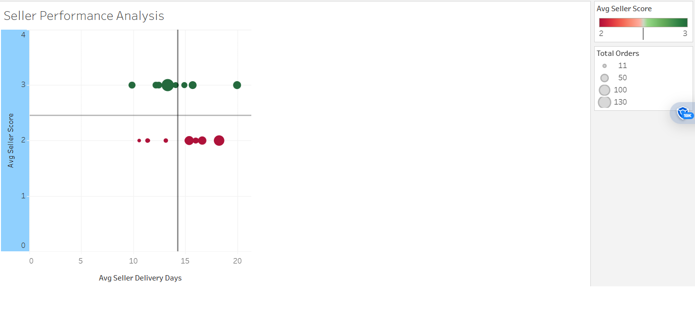

# Olist E-commerce: Logistics & QA Analysis
### Google Data Analytics Capstone Project

**SQL · Power Query · R · Tableau**

### [▶ View the Interactive Dashboard on Tableau Public](https://public.tableau.com/views/OlistE-commerceAnalysisImpactofLogisticsandSellerQAonCustomerSatisfaction/Dashboard1)

---

---

## Project Overview

End-to-end analysis of the Olist e-commerce dataset to identify 
the root cause of a high volume of 1-and-2-star customer reviews.

**Business hypothesis:** Poor logistics performance — specifically, 
long delivery times — is the main driver of customer dissatisfaction.

**Conclusion:** The hypothesis is confirmed with statistical significance.

---

## Key Findings

| Finding | Result |
|---|---|
| Pearson correlation (delivery time vs. review score) | **r = -0.976, p < 0.01** |
| Avg delivery time for 1-star reviews | **21.2 days** |
| Avg delivery time for 5-star reviews | **10.6 days** |
| Most affected regions | North & Northeast Brazil |
| Problem seller quadrant | Below avg score + above avg delivery time |

---

## Dashboard Preview

---

## Analysis Views

### Logistics Performance by Region & QA Score by State

### QA Score vs. Delivery Time

### Seller Performance Analysis — Identifying the Problem Quadrant

The scatter plot identifies sellers in the **bottom-right quadrant** — 
slower than average (>14.9 days) AND lower review scores than average 
(<3.99 stars). These are the highest-priority targets for intervention.

---

## Tools Used

| Tool | Purpose |
|---|---|
| **SQL (MS SQL Server)** | Data loading, type conversion, feature engineering, complex JOINs |
| **Excel + Power Query** | Initial data cleaning, NULL handling, format standardization |
| **R** | Pearson correlation test for statistical validation |
| **Tableau Public** | 4-view interactive dashboard |

---

## The 6-Phase Analysis Process

### 1. ASK
- What is the correlation between delivery time and review score?
- Do late deliveries always result in bad reviews?
- Are there specific geographic regions or sellers underperforming?

### 2. PREPARE
Data sourced from the public **Olist E-Commerce dataset on Kaggle** — 
9 linked `.csv` files covering orders, reviews, sellers, customers, 
products, and logistics.

### 3. PROCESS
- **Power Query:** Pre-processed raw files, handled complex NULL 
  values, standardized formats
- **SQL Server:** Loaded 9 tables into a relational database, 
  converted data types, engineered features (`delivery_time_days`, 
  `delivery_late`)

### 4. ANALYZE
- **SQL:** Complex multi-table JOINs to build 3 analysis tables:
  - `query1_logistics_vs_qa` → bar chart
  - `query2_seller_performance` → scatter plot
  - `query3_geographical_analysis` → maps
- **R:** Pearson correlation test to statistically validate 
  visual findings

### 5. SHARE
Interactive 4-quadrant Tableau dashboard integrating all analyses 
into a single stakeholder-ready story.

### 6. ACT

**Three actionable recommendations:**

1. **Seller Management** — Launch a Seller QA & Performance Program 
   targeting the problem quadrant sellers identified in the scatter plot
2. **Logistics** — Audit regional logistics partners in North and 
   Northeast Brazil where delivery times exceed 22+ days
3. **Customer Experience** — Recalibrate estimated delivery dates 
   using state-by-state delivery averages to manage expectations

---

## Repository Contents

| Folder/File | Description |
|---|---|
| `/SQL_Scripts/` | All `.sql` files used for database analysis |
| `/R_Script/` | `.R` script for Pearson correlation test |
| `/Final_Report/` | PDF executive report |
| `Dashboard_Overview.png` | Full 4-view dashboard screenshot |
| `Dashboard_Logistics_Map.png` | Geographic delivery performance views |
| `Chart_QA_Score_vs_Delivery.png` | QA score vs. delivery time chart |
| `Chart_Seller_Performance.png` | Seller performance scatter plot |

---

## Author

**Diana Novoa**
Data Analyst · SQL · Power Query · R · Tableau
[LinkedIn](https://linkedin.com/in/diana-novoa-624546219) · 
[GitHub](https://github.com/Diannov402)
